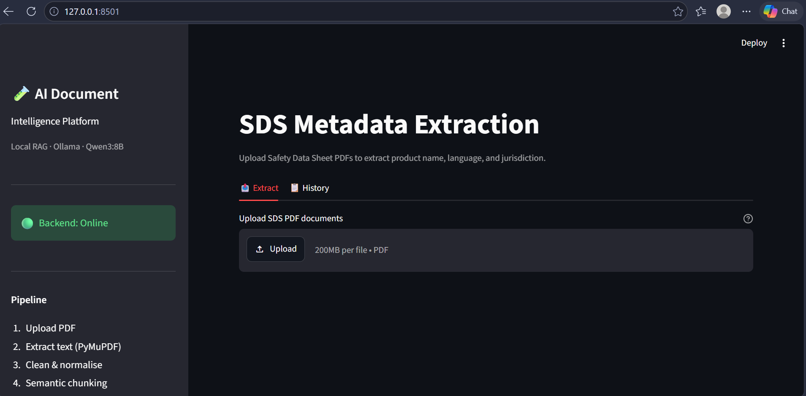
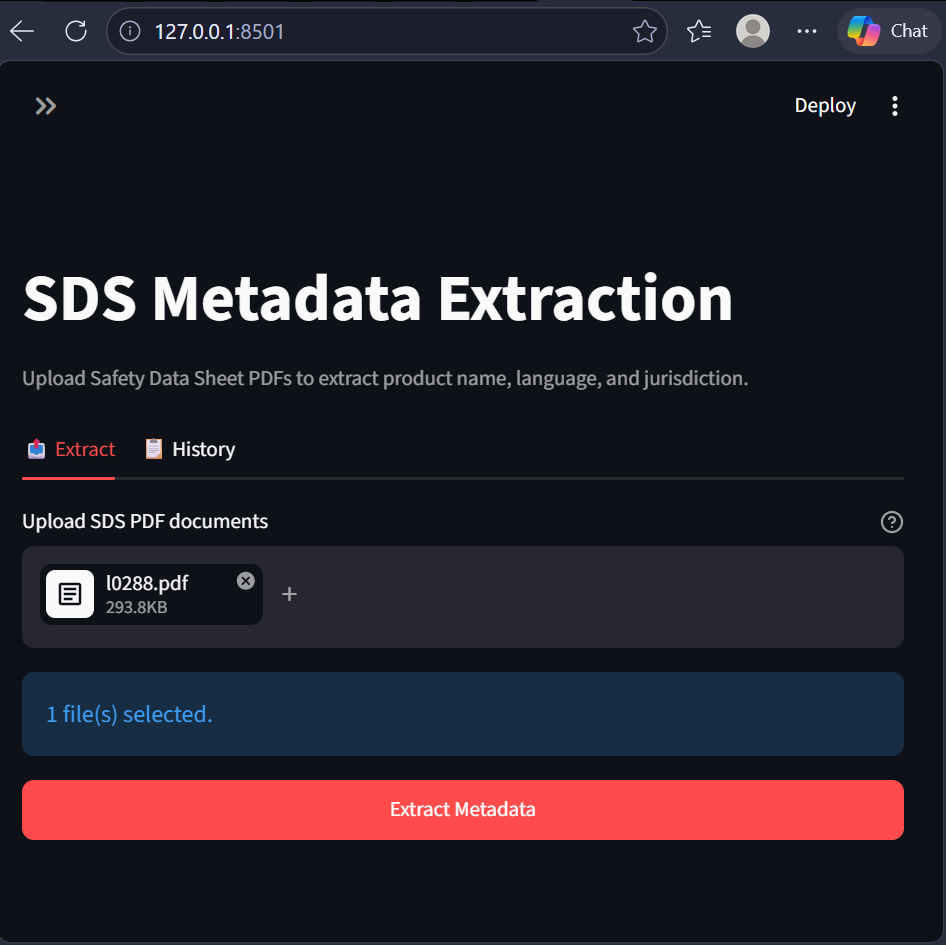
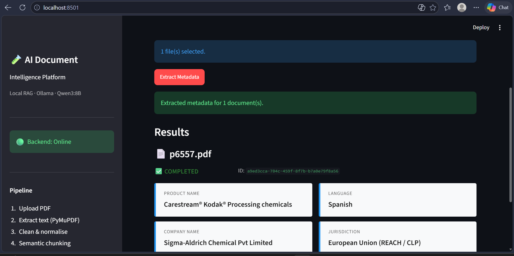
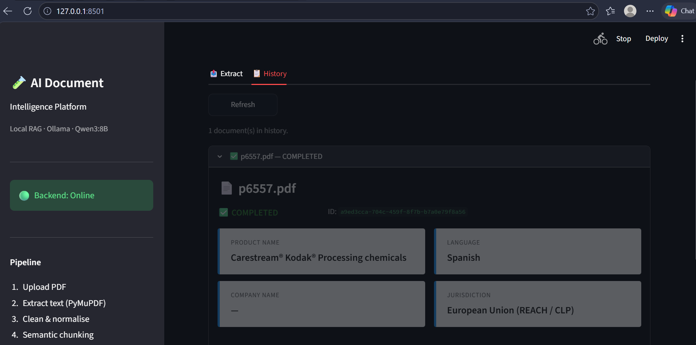
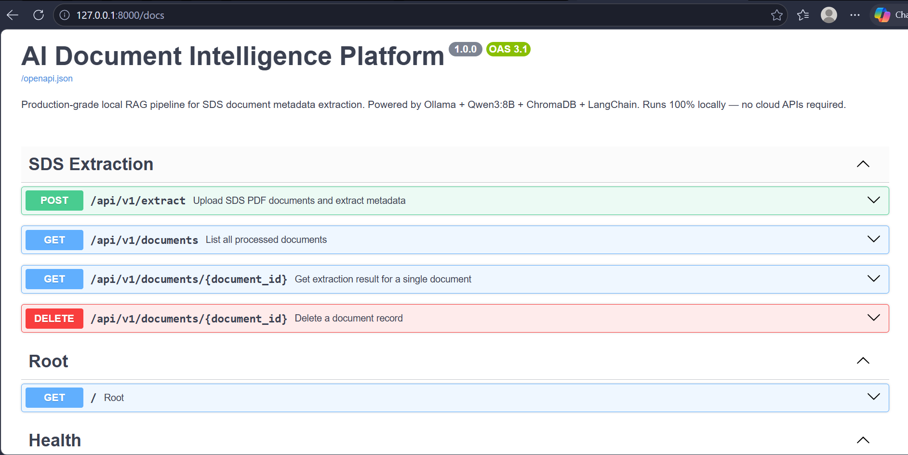
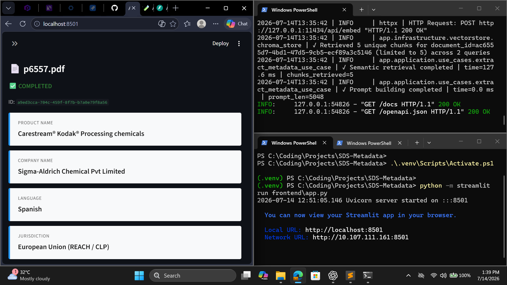

# 🧠 AI Document Intelligence Platform

> A production-oriented AI-powered document intelligence platform that extracts structured metadata from Safety Data Sheets (SDS) using a fully local Retrieval-Augmented Generation (RAG) pipeline powered by Ollama, ChromaDB, FastAPI, and Streamlit.

<p align="center">


</p>

---

# 📌 Overview

Safety Data Sheets (SDS) contain critical information regarding chemicals, hazards, storage conditions, emergency contacts, and regulatory compliance. Manually extracting structured information from these documents is repetitive, time-consuming, and prone to human error.

This project automates that process using a **fully local Retrieval-Augmented Generation (RAG)** pipeline that combines semantic search with a locally hosted Large Language Model (LLM).

Unlike cloud-based AI solutions, this platform:

- Runs completely offline
- Requires no OpenAI or cloud API keys
- Keeps confidential documents on the local machine
- Uses semantic retrieval for improved extraction accuracy
- Stores extraction history for auditing and analysis

---

# 🎯 Objectives

The platform was designed to:

- Extract structured metadata from SDS PDFs
- Use semantic retrieval instead of sending the whole document to an LLM
- Improve extraction accuracy through Retrieval-Augmented Generation (RAG)
- Support local-first AI deployments
- Demonstrate production-oriented software architecture
- Provide a scalable foundation for future enterprise document intelligence workflows

---

# ✨ Features

## Document Processing

- PDF upload
- Automatic text extraction
- Text normalization
- Intelligent chunking
- Metadata extraction
- Structured JSON output

---

## AI Pipeline

- Local Ollama inference
- Qwen3:8B LLM
- Nomic embedding model
- ChromaDB vector search
- Semantic Retrieval
- Prompt engineering
- Response validation

---

## Backend

- FastAPI REST API
- Dependency Injection
- Clean Architecture
- Repository Pattern
- Async processing
- Structured logging
- SQLite persistence

---

## Frontend

- Streamlit UI
- Upload interface
- Extraction results
- Processing history
- Status indicators

---

# 🏗 System Architecture

```
                    +----------------------+
                    |    Streamlit UI      |
                    +----------+-----------+
                               |
                               |
                               v
                    +----------------------+
                    |     FastAPI API      |
                    +----------+-----------+
                               |
                               |
             +-----------------+------------------+
             |                                    |
             v                                    v

     Application Layer                 Infrastructure Layer

             |                                    |
             |                                    |
             v                                    v

      Use Cases                     Ollama / ChromaDB / SQLite

             |
             |
             v

       Domain Layer
```

---

# 🔄 RAG Pipeline

```
PDF Upload
     │
     ▼

Extract Text (PyMuPDF)

     │
     ▼

Clean & Normalize

     │
     ▼

Semantic Chunking

     │
     ▼

Generate Embeddings
(nomic-embed-text)

     │
     ▼

Store in ChromaDB

     │
     ▼

Retrieve Relevant Chunks

     │
     ▼

Prompt Qwen3:8B

     │
     ▼

Parse Response

     │
     ▼

Validate Metadata

     │
     ▼

Store in SQLite

     │
     ▼

Display Results
```

---

# 🖼 Application Screenshots

## Home



---

## Upload Document



---

## Extraction Result



---

## Processing History



---

## Swagger API



---

## System Running



---

# 🛠 Technology Stack

| Layer | Technology |
|--------|------------|
| Language | Python 3.12+ |
| Backend | FastAPI |
| Frontend | Streamlit |
| LLM | Ollama (Qwen3:8B) |
| Embeddings | nomic-embed-text |
| Vector Database | ChromaDB |
| Database | SQLite |
| PDF Parsing | PyMuPDF |
| Testing | Pytest |
| Logging | Python Logging |
# 📁 Project Structure

```text
SDS-Metadata/
│
├── app/
│   ├── application/
│   │   ├── services/
│   │   └── use_cases/
│   │
│   ├── domain/
│   │   ├── entities/
│   │   ├── exceptions/
│   │   └── repositories/
│   │
│   ├── infrastructure/
│   │   ├── configuration/
│   │   ├── database/
│   │   ├── embeddings/
│   │   ├── llm/
│   │   ├── parser/
│   │   ├── retrieval/
│   │   ├── vectorstore/
│   │   └── logging/
│   │
│   ├── presentation/
│   │   ├── routers/
│   │   ├── dependencies/
│   │   └── schemas/
│   │
│   └── main.py
│
├── frontend/
│
├── tests/
│
├── docs/
│   └── images/
│
├── requirements.txt
├── pyproject.toml
├── docker-compose.yml
├── Dockerfile
└── README.md
```

---

# 🚀 Getting Started

## Prerequisites

Before running the project, install:

- Python 3.12+
- Ollama
- Git

---

## Install Ollama

Download:

https://ollama.com

Pull the required models.

```bash
ollama pull qwen3:8b
```

```bash
ollama pull nomic-embed-text
```

Verify:

```bash
ollama list
```

You should see:

```
qwen3:8b
nomic-embed-text
```

---

# Clone Repository

```bash
git clone https://github.com/ps-abhijit-kumar/SDS-Metadata.git

cd SDS-Metadata
```

---

# Create Virtual Environment

Windows

```powershell
python -m venv .venv
```

Activate

```powershell
.\.venv\Scripts\Activate.ps1
```

---

# Install Dependencies

```powershell
pip install -r requirements.txt
```

---

# Configure Environment

Copy

```text
.env.example
```

to

```text
.env
```

Update values if necessary.

---

# Start Ollama

Usually Ollama starts automatically.

Verify:

```powershell
ollama ps
```

or

```powershell
Invoke-RestMethod http://127.0.0.1:11434/api/tags
```

---

# Start Backend

```powershell
python -m uvicorn app.main:app --reload
```

Backend

```
http://127.0.0.1:8000
```

Swagger

```
http://127.0.0.1:8000/docs
```

---

# Start Frontend

Open another terminal.

```powershell
.\.venv\Scripts\Activate.ps1
```

Run

```powershell
python -m streamlit run frontend/app.py
```

Application

```
http://localhost:8501
```

---

# Example Workflow

1. Upload an SDS PDF.
2. Click **Extract**.
3. The system:

- extracts text
- creates semantic chunks
- generates embeddings
- searches ChromaDB
- prompts Qwen3:8B
- validates extracted metadata
- stores the result in SQLite

4. View structured output.

---

# Sample Output

```text
Product Name
-------------------------
Lipid Mixture 1, Chemically Defined

Company Name
-------------------------
Sigma-Aldrich Chemical Pvt. Ltd.

Language
-------------------------
Spanish

Jurisdiction
-------------------------
European Union (REACH / CLP)
```

---

# API Endpoints

| Method | Endpoint | Description |
|---------|----------|-------------|
| GET | / | Health Status |
| POST | /extract | Extract SDS Metadata |
| GET | /history | Previous Extractions |
| GET | /docs | Swagger Documentation |

---

# Configuration

The application uses environment variables.

Important variables include:

| Variable | Purpose |
|-----------|----------|
| OLLAMA_BASE_URL | Ollama Server |
| OLLAMA_MODEL | LLM Model |
| OLLAMA_EMBEDDING_MODEL | Embedding Model |
| CHROMA_DB_DIR | Vector Database |
| SQLITE_DB_PATH | SQLite Database |

---

# Logging

Logs are written to:

```
logs/
```

Typical log entries include:

- application startup
- extraction requests
- embedding generation
- retrieval
- LLM calls
- database operations
- errors
- performance metrics

---

# Testing

Run unit tests.

```powershell
pytest
```

Run with verbose output.

```powershell
pytest -v
```

Run end-to-end verification.

```powershell
python test_e2e.py
```

---

# Performance Characteristics

Current implementation supports:

- Local inference
- Offline execution
- Semantic retrieval
- Batched embeddings
- Async extraction pipeline
- SQLite persistence
- Chroma vector search
- Multiple document history

---

# Security

The platform is designed with a local-first approach.

Benefits include:

- No cloud APIs
- No external LLM requests
- Documents remain on the local machine
- Offline processing
- Environment-based configuration

---

# Engineering Highlights

This project demonstrates:

- Clean Architecture
- Dependency Injection
- Repository Pattern
- Retrieval-Augmented Generation (RAG)
- Local LLM Integration
- Vector Database Design
- Semantic Search
- Async Processing
- Production Logging
- Modular Design
- Configuration Management
- Enterprise Project Structure
---

# 💼 Skills Demonstrated

This project demonstrates practical experience with modern AI engineering and backend development.

### Artificial Intelligence

- Built a fully local Retrieval-Augmented Generation (RAG) pipeline.
- Integrated Ollama-hosted Qwen3:8B for metadata extraction.
- Implemented semantic retrieval using vector embeddings.
- Used embedding-based context retrieval to improve LLM accuracy.
- Eliminated dependency on cloud AI APIs for secure, offline inference.

---

### Backend Engineering

- Developed REST APIs using FastAPI.
- Applied Clean Architecture principles for separation of concerns.
- Implemented dependency injection for modularity and maintainability.
- Designed reusable service and repository layers.
- Added structured logging and centralized exception handling.

---

### Data Engineering

- Parsed Safety Data Sheets (SDS) using PyMuPDF.
- Implemented document preprocessing and normalization.
- Generated semantic embeddings using nomic-embed-text.
- Persisted structured metadata in SQLite.
- Indexed document chunks using ChromaDB for efficient retrieval.

---

### Software Engineering

- Modular enterprise project structure.
- Environment-driven configuration.
- Async document processing.
- Version-controlled development using Git.
- Docker-ready deployment structure.
- Comprehensive project documentation.

---

# 💡 Engineering Challenges & Solutions

| Challenge | Solution |
|-----------|----------|
| Large SDS documents | Semantic chunking before LLM inference |
| Hallucinated responses | Retrieval-Augmented Generation (RAG) |
| Cloud dependency | Fully local Ollama deployment |
| Slow embedding generation | Batched embedding requests |
| Long processing pipeline | Modular asynchronous services |
| Configuration management | Environment-based settings |
| Reusability | Clean Architecture with dependency injection |

---

# ⚡ Performance Optimizations

Current optimizations include:

- Batched embedding generation.
- Persistent ChromaDB vector storage.
- Local inference without network latency.
- Reusable dependency container.
- Async extraction pipeline.
- Lightweight SQLite persistence.
- Modular service architecture.
- Structured logging for easier debugging.

---

# 🚀 Future Roadmap

## Version 1.1

- Hybrid Search (Dense + Keyword Retrieval)
- Metadata Filtering
- Improved Prompt Templates
- Better Response Validation
- API Versioning
- Enhanced Logging

---

## Version 1.2

- Batch PDF Processing
- Multi-document Extraction
- Confidence Scores
- Export to CSV / Excel
- Background Task Queue
- Performance Dashboard

---

## Version 2.0

- Multi-user Authentication
- PostgreSQL Support
- Redis Caching
- Kubernetes Deployment
- CI/CD Pipeline
- Monitoring with Prometheus & Grafana
- Cloud Deployment Options
- OCR Support for Scanned PDFs
- Support for Multiple Document Types

---

# 📊 Current Capabilities

| Feature | Status |
|---------|--------|
| Local AI Inference | ✅ |
| FastAPI Backend | ✅ |
| Streamlit Frontend | ✅ |
| RAG Pipeline | ✅ |
| ChromaDB | ✅ |
| SQLite Storage | ✅ |
| Semantic Search | ✅ |
| PDF Processing | ✅ |
| Docker Support | ✅ |
| Offline Execution | ✅ |

---

# 📌 Known Limitations

Current version supports:

- SDS documents only.
- English and multilingual documents with language detection.
- Single-document processing through the interface.
- Local deployment.

Future versions will introduce broader document support, scalable processing, and enterprise deployment options.

---

# 🤝 Contributing

Contributions are welcome.

If you find bugs, have feature ideas, or would like to improve the platform:

1. Fork the repository.
2. Create a feature branch.
3. Commit your changes.
4. Open a Pull Request.

---

# Performance Notes

This platform runs **100% locally** and does not rely on any cloud APIs.

### Hardware Used for Verification

- CPU: Intel Core i7-10810U
- RAM: 32 GB
- Operating System: Windows 11
- Ollama
- Qwen3:8B
- nomic-embed-text

### Processing Time

The complete SDS extraction pipeline has been verified successfully.

Typical pipeline stages:

- PDF Extraction
- Text Cleaning
- Semantic Chunking
- Embedding Generation
- ChromaDB Storage
- Semantic Retrieval
- Prompt Generation
- LLM Inference
- Metadata Validation
- SQLite Persistence

On CPU-only systems, the LLM inference stage may take several minutes depending on:

- Document size
- Number of retrieved chunks
- Available CPU resources
- Ollama model performance

For the verified development environment, larger SDS documents required approximately **8–10 minutes** for complete extraction using **Qwen3:8B**.

This is expected behavior for a fully local LLM pipeline and does not affect extraction accuracy.

---

# 📄 License

This project is released under the MIT License.

---

# 👨‍💻 Author

**Abhijit Kumar**

AI Engineering Student

GitHub:
https://github.com/ps-abhijit-kumar

---

# 🙏 Acknowledgements

This project leverages the excellent work of the open-source community, including:

- FastAPI
- Streamlit
- Ollama
- ChromaDB
- LangChain
- PyMuPDF
- SQLite

Special thanks to the maintainers of these projects for enabling local AI application development.

---

# ⭐ Support

If you found this project helpful:

- ⭐ Star this repository
- 🍴 Fork it
- 💡 Share feedback
- 🤝 Contribute improvements

---

> **AI Document Intelligence Platform** demonstrates how Retrieval-Augmented Generation (RAG), local LLMs, vector databases, and clean software architecture can be combined to build secure, scalable, and production-oriented document intelligence systems without relying on external AI services.